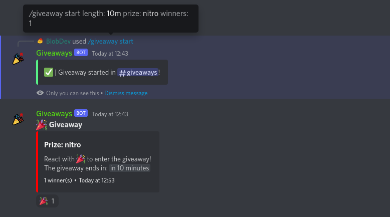
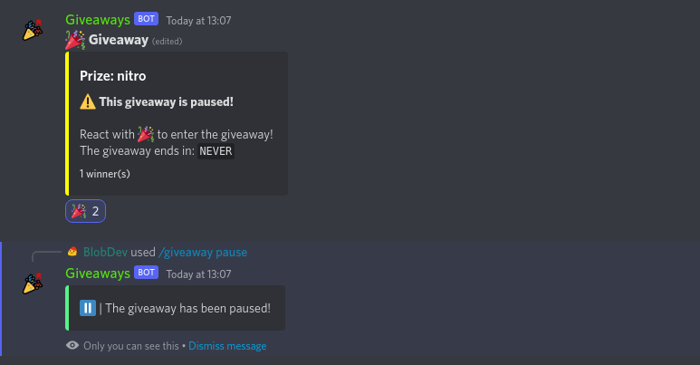
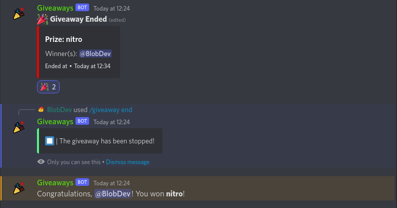
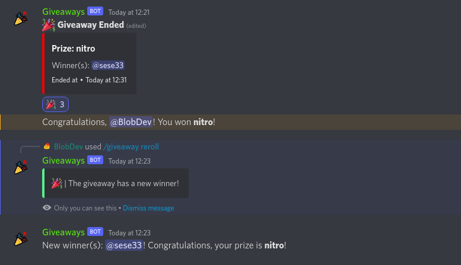
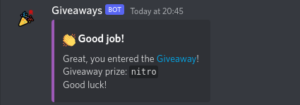
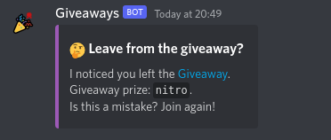
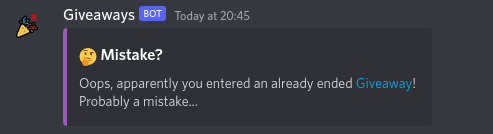

# Giveaway Bot
#### Cool discord for giveaways on your discord server written in Discord.JS v14, discord-giveaways v6 and using custom handlers. Easy to setup. 

# Requirements
- [Node.JS](https://nodejs.org) v16+
- [Computer](https://www.youtube.com/watch?v=dQw4w9WgXcQ)

# Configuration
- Download [CODE](https://github.com/BlobDeveloper/discord-giveaway-bot/archive/refs/heads/main.zip)
- Open `config.js` file in `src` folder
- Change things that are required
- That's it, then open project in terminal and type 
```
npm i && node .
```

# Links
- 🔗 [Discord Developers Portal](https://discord.com/developers/)
- 🔗 [MongoDB](https://mongodb.com/)

# Features
- Complete code ready to work properly
- Bot uses MongoDB database to store data and not JSON
- Free
- Customizable
- Latest Discord.JS version
- Custom Handlers
- Slash Commands
- Giveaway events such as joining a contest, leaving a giveaway, winning a giveaway, etc. (The bot sends a private message about these events to the reaction member.)

# Commands

### Info:
- help
- ping

### Giveaways:
- start
- pause
- unpause
- end
- reroll
- delete

# Preview

#### Start Giveaway


#### Pause Giveaway


#### End Giveaway


### Reroll Giveaway

- And much more!

# Events
### Enter Giveaway


### Leave from Giveaway


### Enter ended Giveaway

- And much more!

<br>
If you like this project, support it with a star<br>
<br>

Did you find a bug?<br>
Please create an issue! https://github.com/BlobDeveloper/discord-giveaways-bot/issues
